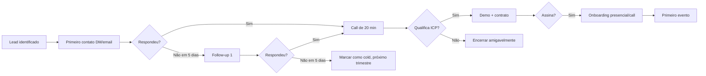

# Piloto Fechado — Produtoras Beta (Fase 1)

**Período:** junho–agosto/2026
**Meta:** 3–5 produtoras parceiras · GMV agregado capado em R$ 250k · 8 eventos publicados

## Critérios de seleção

### Obrigatórios
- [ ] **GMV histórico de R$ 50k–R$ 500k por evento**
- [ ] **Já produziu ≥ 3 eventos** nos últimos 12 meses (não é primeira vez)
- [ ] **Localização: São Paulo, Campinas, Curitiba, Florianópolis, Belo Horizonte ou Rio de Janeiro**
- [ ] **Aceita check-in facial** como diferencial (não como bloqueio)
- [ ] **Disposição a participar de feedback** estruturado (NPS + 1h de entrevista pós-evento)

### Preferenciais
- Marca já reconhecida no nicho
- Volume previsto: 1k–5k ingressos no evento piloto
- Equipe operacional própria (porteiros, staff) — não terceirizada
- Aberto a publicar case study após o lançamento

### Bloqueadores
- Eventos para crianças/adolescentes (idade <18) — política exclui
- Eventos políticos/religiosos (risco de reputação até consolidar marca)
- Histórico de chargeback alto (>3% em outro player)
- Antecipação de recebíveis como exigência (não disponível)

## Benefícios oferecidos

| Benefício | Detalhe |
|---|---|
| **Taxa promocional** | 8% nos primeiros 3 eventos (em vez de 10%) |
| **Suporte dedicado** | Canal direto WhatsApp com fundador, prioridade total |
| **Onboarding presencial** | 2h em SP ou call estendido remoto |
| **Co-marketing** | Logo na seção "Parceiros Fundadores" do site pós-launch + 1 post conjunto no Instagram |
| **Acesso antecipado** | Features beta antes de qualquer outro produtor |
| **Voz no roadmap** | Direito de votar em até 3 features por trimestre |

## Shortlist inicial (a preencher)

> 20 nomes para outbound, 5 de conversão alvo. Preencher com produtoras que você já conhece.

| # | Produtora | Cidade | Tipo | Contato | Status |
|---|---|---|---|---|---|
| 1 | `[TBD]` | `[TBD]` | `[TBD]` | `[TBD]` | `[ ] não contatada / 🟡 em conversa / ✅ aceita / ❌ recusou` |
| 2 | | | | | |
| 3 | | | | | |
| 4 | | | | | |
| 5 | | | | | |

## Template de outbound — DM/WhatsApp

```
Oi [NOME],

Tô lançando uma plataforma de venda de ingressos focada em produtoras
como a sua. Diferencial principal é check-in facial nativo (fim da fila no portão)
+ repasse D+1 do evento + taxa única de 10%.

Tô convidando 5 produtoras pra fase piloto fechada com **taxa promocional de 8%**
nos 3 primeiros eventos e suporte direto comigo. Topa uma call de 20 min essa
semana pra mostrar o produto?

Pulse: [link landing-page]
```

## Template de outbound — E-mail

**Assunto:** Convite — fase piloto Pulse (5 vagas, taxa 8%)

```
Olá, [NOME].

Sou [VOCÊ], fundador da Pulse — plataforma de venda de ingressos com
check-in facial nativo, repasse D+1 e taxa única de 10%.

Estou abrindo 5 vagas para a fase piloto fechada (junho–agosto/2026)
com **taxa promocional de 8%** nos 3 primeiros eventos e suporte
direto comigo.

Vi que [contexto específico — ex: vc produz a festa X que sempre lota].
Acredito que o diferencial do check-in facial e do repasse D+1
faz sentido pro seu modelo.

Tenho disponibilidade essa semana para um call de 20 min — anexo
3 horários sugeridos. Caso prefira, posso passar mais detalhes
por aqui antes.

Material rápido:
- Demo: [URL]
- Tabela de preços: [URL]/precos
- Sobre nós: [URL]

Abraço,
[VOCÊ]
Pulse — pulse.com.br
```

## Fluxo de qualificação



## Métricas de qualificação por etapa

| Etapa | Meta de conversão |
|---|---|
| Lead → primeiro contato | 100% |
| Contato → resposta | 30% |
| Resposta → call agendado | 70% |
| Call → demo (qualificou) | 50% |
| Demo → assinatura de contrato | 60% |
| Contrato → primeiro evento publicado | 90% |

Funil agregado esperado: **20 leads → 6 respostas → 4 calls → 2 demos → ~1 assinatura**. Para fechar 5 produtoras, precisa de **~100 leads de outbound** no funil total.

## Pós-evento — entrevista estruturada (1h)

Roteiro: ver `playbook-promoters.md` §"Entrevista Pós-Evento" (template compartilhado).

Coletar especificamente:
1. **Operação** — quantos minutos médios de check-in? Houve fila? Erros faciais?
2. **Financeiro** — recebeu o D+1? Painel financeiro foi suficiente?
3. **Marketing** — link de promoter funcionou? Importação de mailing? Push para clientes?
4. **NPS** — 0–10, recomendaria a outro produtor?
5. **Top 3 frustrações** + **Top 3 wins**
6. **Roadmap requests** — o que falta para você usar como plataforma única?
