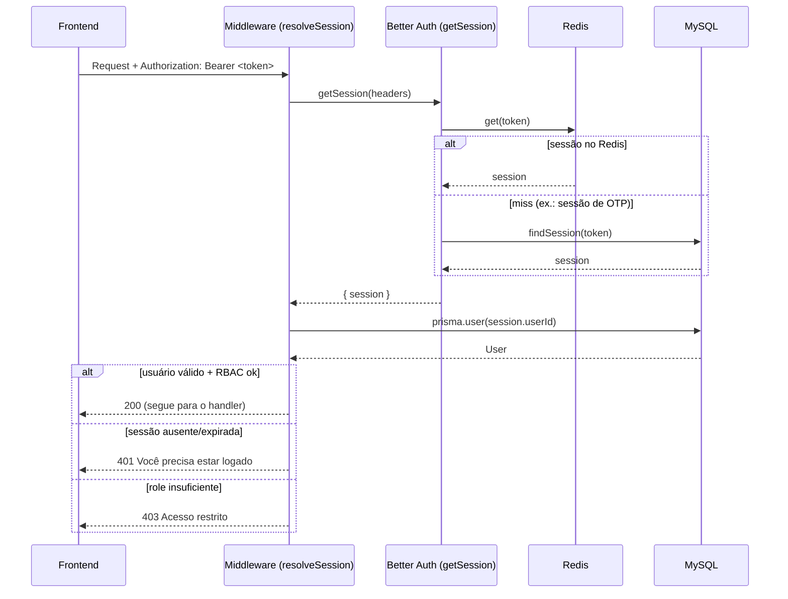

# Autenticação e sessões

Documento de referência do fluxo de autenticação do Pulse, válido para os
quatro frontends (producer-web, client-web, app-producer, app-client) e os três
contextos de backend (cliente B2C, produtor B2B, admin interno).

> **Princípio central:** existe **um único caminho de resolução de sessão** no
> backend — `auth.api.getSession` do Better Auth — e **uma única forma de
> revogar** sessões. Todos os middlewares e fluxos de logout convergem para ele.
> Ver [ADR-002](../decisoes/ADR-002-authentication-strategy.md).

---

## Armazenamento de sessão: Redis + MySQL

O Better Auth está configurado com:

- **`secondaryStorage` (Redis/Upstash)** — caminho quente. Toda leitura de sessão
  (`getSession`) bate primeiro no Redis.
- **`session.storeSessionInDatabase: true`** — persiste a sessão **também** na
  tabela `session` do MySQL.

Os dois juntos são intencionais e necessários:

| Store | Papel |
|-------|-------|
| Redis | Leitura rápida da sessão (caminho quente) + rate-limit distribuído |
| MySQL | Fonte durável; fallback do `getSession` quando o Redis não tem a chave; base dos relatórios que leem `session` (ex.: métricas admin) |

> **Por que a flag importa (regressão histórica):** quando o Redis foi
> introduzido como `secondaryStorage` **sem** `storeSessionInDatabase`, o Better
> Auth passou a gravar a sessão **somente no Redis**. Os middlewares que
> resolviam o Bearer token consultando `prisma.session` diretamente pararam de
> encontrar a sessão → 401 "Você precisa estar logado". A flag realinha o MySQL
> como fonte durável e dá ao `getSession` um fallback no banco.

---

## Como a sessão é criada

Há dois caminhos de criação, mas **um só de resolução**:

| Fluxo | Como cria | Onde fica | Resolvido por |
|-------|-----------|-----------|---------------|
| Login por senha / social (`signInEmail`) — producer-web, client-web, apps | Better Auth | Redis **+** MySQL | `getSession` |
| OTP de e-mail (client `verify-otp`, admin `login/verify-otp`) | `prisma.session.create` direto | MySQL | `getSession` (fallback no banco) |

O OTP cria a sessão direto no MySQL porque não há senha para alimentar o
`signInEmail`. Como `storeSessionInDatabase` está ativo, o `getSession` faz
fallback no banco e resolve esse token normalmente — então **o consumidor não
percebe diferença** entre os dois caminhos.

---

## Resolução de sessão (único caminho)

`backend/src/infrastructure/auth/sessionResolver.ts` expõe o helper canônico:

```ts
resolveSession(headers): Promise<{ user, session } | null>
```

1. Valida via `auth.api.getSession({ headers })` — aceita **cookie** ou
   **`Authorization: Bearer <token>`** (plugin `bearer()`), resolvendo no Redis
   com fallback no MySQL.
2. Carrega o `User` completo do domínio pelo `id`.
3. Retorna `null` para sessão ausente/expirada ou usuário inexistente/excluído.

Os **três** middlewares usam esse helper — não há mais consulta manual a
`prisma.session`:

| Middleware | Escopo | Regra extra após `resolveSession` |
|------------|--------|-----------------------------------|
| `AuthMiddleware` (global) | Todas as rotas | Gate de rotas públicas + `mustChangePassword` |
| `ProducerAuthMiddleware` | `/api/producer/v1/*` | RBAC do portal + contexto `x-producer-id` (tenant) |
| `AdminAuthMiddleware` | `/api/admin/v1/*` | Exige `role = PULSE_ADMIN` |

---

## Logout e revogação

Toda revogação passa por `sessionResolver.ts` e limpa **os dois stores**:

| Função | Uso |
|--------|-----|
| `revokeSessionByToken(token)` | Logout de uma sessão (producer, client, admin) |
| `revokeAllUserSessions(userId)` | Exclusão/anonimização de conta (LGPD) |

Ambas delegam ao `internalAdapter` do Better Auth (`deleteSession` /
`deleteSessions`), que remove a chave do Redis **e** a linha do MySQL.

> Os **dois apps web** chamam o logout no servidor de forma simétrica:
> `POST /api/producer/v1/auth/logout` e `POST /api/client/v1/auth/logout`.
> Sem isso, um token "deslogado" continuaria válido no Redis até o TTL.

---

## Contrato dos frontends

Os quatro frontends seguem o mesmo contrato:

| Item | Convenção |
|------|-----------|
| Header de auth | `Authorization: Bearer <token>` |
| Identificação do app | `x-pulse-app: <surface>-<platform>` |
| Contexto de tenant (só producer) | `x-producer-id: <id>` |
| Armazenamento do token (web) | cookie `pulse_<surface>_token` (`pulse_producer_token`, `pulse_client_token`) |
| Armazenamento do token (mobile) | Expo SecureStore (`pulse_token`), via módulo único `sessionStorage` |
| Logout | chama o endpoint de logout do próprio contexto (revoga no servidor) + limpa o token local |

### Convenção `x-pulse-app` (ponta a ponta)

Formato canônico **`<surface>-<platform>`**. O backend só decide por **surface**,
então normaliza pelo prefixo (`resolveAppSurface` em
`backend/src/shared/http/appSurface.ts`) — tolerante a valores legados e a novas
plataformas.

| Cliente | Valor enviado |
|---------|---------------|
| producer-web | `producer-web` |
| client-web | `client-web` |
| app-producer | `producer-mobile` |
| app-client | `client-mobile` |

Surfaces válidas: `producer`, `client`, `admin`.

### Sessão única no cliente mobile

Nos apps Expo o token vive **só** em `sessionStorage` (SecureStore, chave
`pulse_token`) — Eden, repositórios e store leem/escrevem por esse módulo. O
login social passa pelo Better Auth Expo client apenas para o fluxo OAuth e, ao
final, grava o token no `sessionStorage` (autoridade única). Não há segunda
fonte de sessão concorrente.

### Tratamento de 401 centralizado

Quando uma sessão expira/é revogada, o backend responde **401 com
`code: SESSION_EXPIRED`** (`AuthMiddleware`, `ProducerAuthMiddleware`,
`AdminAuthMiddleware`). Nos apps mobile, o cliente Eden tem um hook `onResponse`
que, ao ver esse code, limpa o token e emite um evento (`authEvents`) que o store
assina para zerar o estado e voltar ao login — sem ciclo de import e sem 401
espalhado por chamada. 401 de outras origens (ex.: senha errada no login) **não**
disparam logout, pois não carregam esse code.

---

## Diagramas

### Login (senha) e primeira requisição autenticada

```
  Frontend                Backend                 Better Auth        Redis   MySQL
     │                       │                          │              │       │
     │  POST /auth/login     │                          │              │       │
     │──────────────────────>│  signInEmail()           │              │       │
     │                       │─────────────────────────>│  cria sessão │       │
     │                       │                          │─────────────>│  set  │
     │                       │                          │──────────────────────>│ insert
     │  { user, token }      │<─────────────────────────│              │       │
     │<──────────────────────│                          │              │       │
     │  (guarda token no cookie pulse_<app>_token)       │              │       │
     │                       │                          │              │       │
     │  GET /...  + Bearer    │                          │              │       │
     │──────────────────────>│  resolveSession()        │              │       │
     │                       │─ getSession(headers) ───>│  lê Redis ──>│  hit  │
     │                       │  (miss → fallback MySQL) ─────────────────────-->│ select
     │                       │  + prisma.user(id)        │              │       │
     │  200 + dados          │<── user/session ──────────│              │       │
     │<──────────────────────│                          │              │       │
```

### Logout

```
  Frontend            Backend                       Better Auth     Redis   MySQL
     │  POST /auth/logout + Bearer │                      │            │       │
     │────────────────────────────>│ revokeSessionByToken │            │       │
     │                             │─ internalAdapter ───>│ deleteSession           │
     │                             │                      │── del ────>│ (Redis)│
     │                             │                      │── delete ──────────────>│ (MySQL)
     │  { success: true }          │<─────────────────────│            │       │
     │<────────────────────────────│ (limpa cookie local) │            │       │
```

### Fluxo de decisão (Mermaid)



---

## Arquivos-chave

| Camada | Arquivo |
|--------|---------|
| Config Better Auth | `backend/src/infrastructure/auth/auth.ts` |
| Resolver + revogação | `backend/src/infrastructure/auth/sessionResolver.ts` |
| Middleware global | `backend/src/presentation/middlewares/AuthMiddleware.ts` |
| Middleware produtor | `backend/src/presentation/middlewares/producer/ProducerAuthMiddleware.ts` |
| Middleware admin | `backend/src/presentation/middlewares/admin/AdminAuthMiddleware.ts` |
| Client (token cookie) | `client-web/src/lib/auth/token.ts`, `producer-web/src/lib/auth/token.ts` |

Ver também: [ADR-002 Authentication Strategy](../decisoes/ADR-002-authentication-strategy.md)
· [Backlog: hashing de session token](../backlog/session-token-hashing.md)
· [Visão geral da arquitetura](./overview.md).
