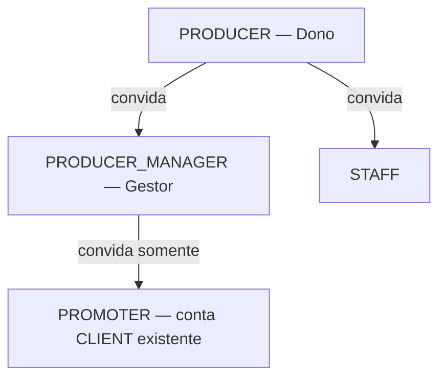

# RBAC Pulse — Papéis e acessos

Documento de referência (produto + engenharia). Estado: **alvo acordado** — implementação pode divergir até os PRs de RBAC.

---

## Papéis

| Código | Nome (UI) | Descrição |
|--------|-----------|-----------|
| `CLIENT` | Cliente | Comprador final; base para promoter |
| `PRODUCER` | Dono / Titular | E-mail do contrato; CNPJ; dono da produtora |
| `PRODUCER_MANAGER` | Gestor | Quase tudo do dono, exceto financeiro consolidado e saque |
| `STAFF` | Equipe (porta) | QR Code, facial, lista / check-in |
| `PROMOTER` | Promoter | Indica vendas; comissões no app cliente (conta já existente) |
| `PULSE_ADMIN` | Operador Pulse | Painel interno Pulse (`/admin`) — não é dono de produtora |

**Equipe (`producer_memberships`):** papéis `STAFF` e `PROMOTER` na tabela `roles`. O dono **não** é membership — `producerId` dos eventos = `User.id` do `PRODUCER`.

---

## Quem convida quem

| Quem convida | Pode convidar | Regras |
|--------------|---------------|--------|
| **Dono** (`PRODUCER`) | **Gestor** (`PRODUCER_MANAGER`), **Staff** (`STAFF`) | Titular do contrato |
| **Gestor** (`PRODUCER_MANAGER`) | **Promoter** (`PROMOTER`) apenas | E-mail já cadastrado no app cliente |
| **Staff** / **Promoter** | — | Sem permissão de convite |

- O dono **não pode ser removido** pela API de equipe (não é `producer_membership`).
- Remoção de **Staff**: só dono. Remoção de **Promoter**: definir na implementação (sugestão: só dono, ou dono + gestor que convidou).

---

## Legenda das tabelas

| Símbolo | Significado |
|---------|-------------|
| ✅ | Permitido |
| ❌ | Bloqueado |
| 🔶 | Parcial (ex.: só por evento) |
| — | Não aplicável |

---

## Tabela geral (capacidades)

| Capacidade | Dono | Gestor | Staff | Promoter | Pulse Admin |
|------------|:----:|:------:|:-----:|:--------:|:-----------:|
| Representa contrato / CNPJ / saque | ✅ | ❌ | ❌ | ❌ | ❌ |
| Dados bancários / Pix | ✅ | ❌ | ❌ | ❌ | ❌ |
| Financeiro consolidado (empresa) | ✅ | ❌ | ❌ | ❌ | ❌ |
| Financeiro **por evento** | ✅ | ✅ | ❌ | ❌ | ❌ |
| Convidar **Gestor** | ✅ | ❌ | ❌ | ❌ | ❌ |
| Convidar **Staff** | ✅ | ❌ | ❌ | ❌ | ❌ |
| Convidar **Promoter** | ✅ | ✅ | ❌ | — | ❌ |
| Remover Gestor / Staff | ✅ | ❌ | ❌ | — | ❌ |
| Criar / editar / publicar evento | ✅ | ✅ | ❌ | ❌ | ❌ |
| Lotes / comercial (editar) | ✅ | ✅ | 🔶 | ❌ | ❌ |
| Check-in QR / facial / lista | ✅ | ✅ | ✅ | ❌ | ❌ |
| Comprar ingresso (como cliente) | 🔶* | 🔶* | 🔶* | ✅ | — |
| Ver comissões de indicação | ❌ | ❌ | ❌ | ✅ | ❌ |
| Painel Pulse interno | ❌ | ❌ | ❌ | ❌ | ✅ |

\*Se tiver conta `CLIENT` à parte; não é fluxo principal do papel.

---

## Por aplicação

### `client-web` (site comprador)

| Capacidade | CLIENT | Dono | Gestor | Staff | Promoter | Pulse Admin |
|------------|:------:|:----:|:------:|:-----:|:--------:|:-----------:|
| Vitrine / eventos públicos | ✅ | — | — | — | — | — |
| Checkout / compra | ✅ | — | — | — | — | — |
| Login painel produtor | — | — | — | — | — | — |
| Comissões promoter | — | — | — | — | — | — |

---

### `app-client` (app comprador)

| Capacidade | CLIENT | Dono | Gestor | Staff | Promoter | Pulse Admin |
|------------|:------:|:----:|:------:|:-----:|:--------:|:-----------:|
| Cadastro / login comprador | ✅ | — | — | — | ✅** | — |
| Ingressos, checkout, perfil | ✅ | — | — | — | ✅** | — |
| Minhas vendas / comissões (`/promoter`) | ❌ | ❌ | ❌ | ❌ | ✅ | — |
| Painel produtor / eventos | — | — | — | — | — | — |

\*\* Promoter = em geral `CLIENT` + membership/event_staff `PROMOTER`.

---

### `producer-web` (portal web — produtora + Pulse Admin)

#### Área produtora (`/dashboard`, `/events`, …)

| Capacidade | Dono | Gestor | Staff | Promoter |
|------------|:----:|:------:|:-----:|:--------:|
| Login | ✅ | ✅ | ✅ | ❌ |
| Dashboard consolidado / GMV empresa | ✅ | ❌ | ❌ | — |
| Eventos (CRUD, publicar) | ✅ | ✅ | ❌ | — |
| Financeiro do **evento** | ✅ | ✅ | ❌ | — |
| `/finance` global (extrato, repasse, antecipação, saque) | ✅ | ❌ | ❌ | — |
| Configurações / perfil / banco | ✅ | ❌ | ❌ | — |
| Equipe — convidar Gestor / Staff | ✅ | ❌ | ❌ | — |
| Equipe — convidar Promoter | ✅ | ✅ | ❌ | — |
| Check-in / operação (se existir na web) | ✅ | ✅ | ✅ | — |

#### Área Pulse Admin (`/admin/*`)

| Capacidade | Dono | Gestor | Staff | Pulse Admin |
|------------|:----:|:------:|:-----:|:-----------:|
| Métricas, produtoras, financeiro admin, compliance | ❌ | ❌ | ❌ | ✅ |

---

### `app-producer` (app operacional produtora)

| Capacidade | Dono | Gestor | Staff | Promoter |
|------------|:----:|:------:|:-----:|:--------:|
| Login | ✅ | ✅ | ✅ | ❌ |
| Tab Início (KPI consolidado / carteira) | ✅ | ❌ | ❌ | — |
| Eventos — criar / editar / publicar | ✅ | ✅ | ❌ | — |
| Financeiro do **evento** (detalhe) | ✅ | ✅ | ❌ | — |
| Tab **Finance** global | ✅ | ❌ | ❌ | — |
| Tab **Access** (QR / facial / lista) | ✅ | ✅ | ✅ | — |
| Settings — banco, perfil titular | ✅ | ❌ | ❌ | — |
| Convidar Gestor / Staff | ✅ | ❌ | ❌ | — |
| Convidar Promoter | ✅ | ✅ | ❌ | — |

---

## API (backend implementado)

| Endpoint | Quem |
|----------|------|
| `POST /api/producer/v1/team/invite-manager` | Dono → gestor (`PRODUCER_MANAGER`) |
| `POST /api/producer/v1/team/invite` (`STAFF`) | Dono |
| `POST /api/producer/v1/team/invite` (`PROMOTER`) | Dono ou gestor (conta cliente existente) |
| `GET /api/producer/v1/finance/events/:eventId/kpis` | Dono ou gestor (`x-producer-id` se gestor) |
| Demais `/finance/*` globais | Dono apenas |

Helper: `backend/src/shared/rbac/producerPortal.ts`.

## Implementação (estado 2026-05-19)

- **Backend:** `producerPortal.ts`, migration `PRODUCER_MANAGER`, convites, financeiro global/por evento, testes unitários RBAC.
- **producer-web:** middleware, sidebar, equipe (gestor + promoter), `invite-manager`.
- **app-producer:** login gestor, tabs finance, settings/equipe por papel, convite promoter (gestor).

---

## Contrato (resumo)

O **Titular** cadastra **Gestores** e **Equipe (Staff)**, gerencia saques e financeiro consolidado. O **Gestor** gerencia eventos e resultados **por evento**, cadastra **Promoters** já registrados no app cliente, sem saque nem relatórios consolidados da empresa. **Staff** limita-se à operação de ingressos (QR / facial). **Promoters** veem apenas suas comissões no app cliente.

---

*Última atualização: 2026-05-19*
