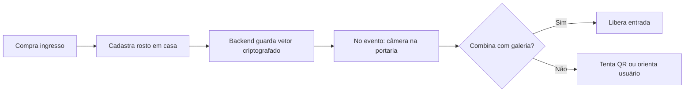

# Como funciona a biometria facial no Pulse

Documento de referência sobre o fluxo facial ponta a ponta: cadastro no app, check-in na portaria, armazenamento de templates e integração opcional com o microserviço **pulse-face**.

**Documentos relacionados:**

- [Segurança e LGPD (biometria)](./facial-lgpd-security.md)
- [Épico — Biometria facial self-hosted](./epic-facial-self-hosted.md)
- [Cadastro facial — limitações do MVP](./facial-enrollment-mvp.md)
- Repositório do microserviço: [jotav-software/pulse-face](https://github.com/jotav-software/pulse-face) (branch `develop`)

---

## O que é o reconhecimento facial no Pulse?

O Pulse quer tornar a entrada no evento mais rápida e segura. A ideia é simples: você **compra o ingresso no app**, **cadastra o rosto em casa** (com boa luz e sem pressa) e, no dia, **passa na catraca** mostrando o rosto em vez de depender só do QR — ou usando o rosto como confirmação extra, conforme a configuração do evento.

O produtor escolhe obrigatoriamente o modo de entrada do evento:

- `QR_ONLY`: entrada por QR Code, sem exigência facial.
- `BIOMETRY_OPTIONAL`: facial disponível com QR como fallback operacional.
- `BIOMETRY_ONLY`: somente facial; o app não exibe QR Code.

Em compras com múltiplos ingressos faciais (`BIOMETRY_OPTIONAL` ou `BIOMETRY_ONLY`), apenas um ingresso fica pronto para o comprador. Os demais ficam pendentes de transferência para que cada convidado use a própria conta/celular e cadastre a própria facial. No modo opcional, o QR desses extras fica bloqueado até a transferência; no modo facial-only, não há QR.

Pense em três momentos:

1. **Antes** — compra e cadastro facial em casa.
2. **No portão** — câmera compara o rosto com quem comprou ingresso para aquele evento.
3. **Nos bastidores** — sistemas que guardam só o necessário para fazer essa comparação (vetor criptografado, galeria por evento, auditoria).

---

## A equipe Pulse “treina” uma IA com fotos dos clientes?

**Não.** Ninguém na Pulse fica “ensinando” uma rede neural com fotos dos usuários. O produto usa **modelos prontos** open source (família **InsightFace** `buffalo_l` em ONNX no servidor **pulse-face**). Com as flags de extração desligadas, os apps ainda podem usar um vetor **determinístico** derivado de hash da imagem (modo MVP legado) — não é treinamento nem envio da foto para APIs de terceiros.

**Cadastrar o rosto** significa **registrar um modelo matemático (template)** para comparar depois. **Não** é treinar inteligência artificial.

---

## Suas fotos vão para a nuvem?

**Por padrão, não armazenamos a foto do rosto** como arquivo na nuvem. O que fica no banco (MySQL), com **criptografia**, é o **vetor biométrico** — basicamente uma lista de números que descreve o rosto sem ser a imagem em si.

A foto fica no celular só no momento da captura; o que viaja para o servidor é o vetor (e metadados de negócio: consentimento, versão dos termos, qualidade, etc.). Detalhes de criptografia, retenção e purge estão em [facial-lgpd-security.md](./facial-lgpd-security.md).

---

## Quais peças existem?

| Peça | Papel |
|------|--------|
| **app-client** (Expo) | Câmera, detecta rosto, monta o vetor e envia ao backend. |
| **app-producer** | Câmera na portaria; faz a comparação **1:N** (qual ingresso bate com esse rosto). |
| **backend** (Bun) | Regras de negócio, galeria por evento no MySQL, similaridade (cosseno) ou chama o serviço facial. |
| **pulse-face** (Python) | Microserviço **opcional** para identificar em escala (muitos rostos no mesmo evento). |

---

## Fluxo resumido



### Fluxo com extração real (Opção A — pulse-face)

Quando `PULSE_FACE_EXTRACT_ENABLED` e `EXPO_PUBLIC_PULSE_FACE_EXTRACT` estão ligados:

```mermaid
sequenceDiagram
  participant App as app-client / app-producer
  participant API as backend Bun
  participant Face as pulse-face
  App->>App: Captura foto (base64 local)
  App->>API: POST /biometry/extract ou /operation/facial-extract
  API->>Face: POST /v1/embedding/extract
  Face-->>API: embedding 512-d + quality
  API-->>App: vetor + qualidade
  App->>API: POST /biometry/update ou /facial-match
  Note over API: Foto não é persistida; só o vetor criptografado no cadastro
```

---

## Quando o sistema usa o pulse-face?

**Resposta curta:** o Pulse **não** escolhe sozinho usar o pulse-face conforme tráfego, fila ou número de acessos. Tudo é **manual**, via variáveis de ambiente no backend (e deploy do microserviço).

### Comportamento padrão (sem pulse-face)

Com as flags de galeria e check-in ligadas, o **backend Bun** faz o **1:N** na portaria comparando o embedding capturado com a **galeria do evento no MySQL**, usando **similaridade de cosseno** no próprio processo Node/Bun. Não é necessário ter pulse-face no ar para esse caminho funcionar — útil para pilotos e eventos menores.

### Quando usar pulse-face (opcional)

O **pulse-face** é recomendado para **eventos grandes** (muitos rostos na mesma galeria), onde buscar 1:N só no MySQL/backend pode ficar mais lento. Mesmo assim, **não há auto-scale**: alguém precisa:

1. Implantar o serviço Python (Railway, Docker, etc.).
2. Configurar `PULSE_FACE_SERVICE_URL` e `PULSE_FACE_SERVICE_API_KEY` no backend e no pulse-face.
3. Sincronizar a galeria (`PULSE_FACE_GALLERY_SYNC=true` no rebuild).
4. Delegar o identify (`PULSE_FACE_USE_IDENTIFY=true`).

Sem esses passos, o backend continua no modo cosseno/MySQL mesmo com muito público.

### Tabela de flags — o que cada uma habilita

| Variável | Onde | Default típico | O que habilita |
|----------|------|----------------|----------------|
| `FACIAL_ENROLLMENT_V2` / `FACIAL_ENROLLMENT_ENABLED` | Backend | `false` | Cadastro com vetor 512-d criptografado (não só hash legado). |
| `EXPO_PUBLIC_FACIAL_ENROLLMENT_V2` | app-client | `false` | App envia vetor real + consentimento (alinha com V2 no backend). |
| `PULSE_FACE_EXTRACT_ENABLED` | Backend | `false` | Proxy `POST /biometry/extract` e `POST /operation/facial-extract` → pulse-face ONNX. |
| `EXPO_PUBLIC_PULSE_FACE_EXTRACT` | app-client + app-producer | `false` | Após captura, envia imagem ao backend para extrair embedding (não hash local). |
| `PULSE_FACE_EXTRACT_TIMEOUT_MS` | Backend | `15000` | Timeout da chamada de extração ao pulse-face. |
| `BIOMETRIC_ENCRYPTION_KEY` | Backend | — | **Obrigatória** em prod com V2: AES-256-GCM do vetor no MySQL. |
| `FACIAL_GALLERY_ENABLED` | Backend | `false` | Monta/atualiza galeria 1:N por evento (`event_face_gallery_entries`). |
| `FACIAL_CHECKIN_ENABLED` | Backend | `false` | Check-in/entrada pelo fluxo facial na operação (`facial-match`). |
| `FACIAL_VERIFY_AFTER_QR_ENABLED` | Backend | `false` | Verificação 1:1 após leitura de QR (confirmação extra). |
| `PULSE_FACE_SERVICE_URL` | Backend | — | URL do microserviço (ex.: `http://pulse-face:8080`). Sem isso, pulse-face não é chamado. |
| `PULSE_FACE_SERVICE_API_KEY` | Backend + pulse-face | — | Autenticação mútua (`x-api-key`). |
| `PULSE_FACE_GALLERY_SYNC` | Backend | `false` | No rebuild da galeria, envia embeddings ao pulse-face (`POST /v1/gallery/{eventId}/rebuild`). |
| `PULSE_FACE_USE_IDENTIFY` | Backend | `false` | Delega o **1:N** ao pulse-face (`POST /v1/identify`) em vez de cosseno só no Bun/MySQL. Requer sync + serviço no ar. |
| `PULSE_FACE_IDENTIFY_THRESHOLD` | Backend / pulse-face | `0.45` | Limiar de match no identify (calibrar em campo). |
| `PULSE_FACE_VERIFY_THRESHOLD` | Backend / pulse-face | `0.50` | Limiar no verify 1:1. |
| `PULSE_FACE_MIN_SCORE_GAP` | Backend / pulse-face | `0.05` | Gap mínimo entre 1º e 2º candidato (evita ambiguidade). |
| `FACE_GALLERY_RETENTION_DAYS` | Backend | `30` | Retenção da galeria por evento após o fim (LGPD). |
| `ENABLE_FACE_GALLERY_PURGE_JOB` | Backend | `false` | Job interno de purge de galerias expiradas. |

Ordem prática sugerida para produção facial completa:

1. Deploy **pulse-face** no Railway (Docker com modelos `buffalo_l` ~300 MB).
2. `PULSE_FACE_SERVICE_URL` + `PULSE_FACE_SERVICE_API_KEY` no backend e no pulse-face.
3. `BIOMETRIC_ENCRYPTION_KEY` + enrollment V2 (app + backend).
4. `PULSE_FACE_EXTRACT_ENABLED` + `EXPO_PUBLIC_PULSE_FACE_EXTRACT` → embeddings InsightFace reais.
5. `FACIAL_GALLERY_ENABLED` → rebuild da galeria nos eventos piloto.
6. `FACIAL_CHECKIN_ENABLED` → portaria facial.
7. (Opcional, >~10k rostos ou latência) `PULSE_FACE_GALLERY_SYNC` + `PULSE_FACE_USE_IDENTIFY=true` — até ~10k eventos, cosseno MySQL/NumPy costuma bastar.

---

## Feature flags — não liga sozinho em produção

O código facial está avançado, mas **em produção só funciona de verdade** quando as flags e segredos certos estão ligados:

- **FACIAL_ENROLLMENT_V2** (no app: `EXPO_PUBLIC_FACIAL_ENROLLMENT_V2`) — cadastro com vetor real (V2), em vez do modo legado só com “hash”.
- **FACIAL_GALLERY_ENABLED** — monta/atualiza a galeria de rostos do evento.
- **FACIAL_CHECKIN_ENABLED** — permite check-in/entrada pelo fluxo facial na operação.
- **BIOMETRIC_ENCRYPTION_KEY** — chave para criptografar o vetor no banco (obrigatória no V2).
- **pulse-face** implantado e apontado pelo backend — recomendado quando há muita gente no mesmo evento; **não** é ativado automaticamente por carga.

Referência completa no backend: `backend/.env.example` (seção facial / pulse-face).

---

## O que já funciona hoje vs o que precisa ligar

| Situação | Status |
|----------|--------|
| **Check-in por QR** | Funciona no fluxo normal. |
| **Facial (cadastro + portaria)** | Código pronto, mas precisa das flags acima, da chave de criptografia e, para escala, do **pulse-face** no ar. Sem isso, o facial fica desligado ou em modo antigo/teste. |
| **1:N só no backend (MySQL + cosseno)** | Disponível com `FACIAL_GALLERY_ENABLED` + `FACIAL_CHECKIN_ENABLED`; não exige pulse-face. |
| **1:N delegado ao pulse-face** | Exige deploy do microserviço + URL/API key + `PULSE_FACE_GALLERY_SYNC` + `PULSE_FACE_USE_IDENTIFY=true`. |

---

## pulse-face no GitHub

O serviço Python que faz identificação em escala tem repositório próprio: **[jotav-software/pulse-face](https://github.com/jotav-software/pulse-face)** (branch principal de trabalho: `develop`).

Ele compara vetores (similaridade de cosseno NumPy; FAISS opcional no roadmap). Com Docker atual, os modelos **buffalo_l** são baixados no build (~280–330 MB). `GET /health` expõe `onnxExtract: configured` quando o extrator está pronto. Ver README do repositório e [épico facial](./epic-facial-self-hosted.md) (US-FAC-013).

---

## Nota sobre versionamento deste documento

A pasta `docs/` na raiz do workspace Pulse (`/Users/jhonatanlopes/workspace/pulse/docs`) **não** faz parte do repositório Git do `pulse-backend` (o backend versiona apenas `backend/docs/`). Se a documentação de produto precisar ir para o monorepo oficial, copie ou sincronize este arquivo para o destino acordado no time (por exemplo `pulse-backend/docs/produto/` ou o repositório de documentação central).

*Não há symlink automático entre workspace local e backend — mantenha uma cópia manual ou um script de sync se usar os dois lugares.*
