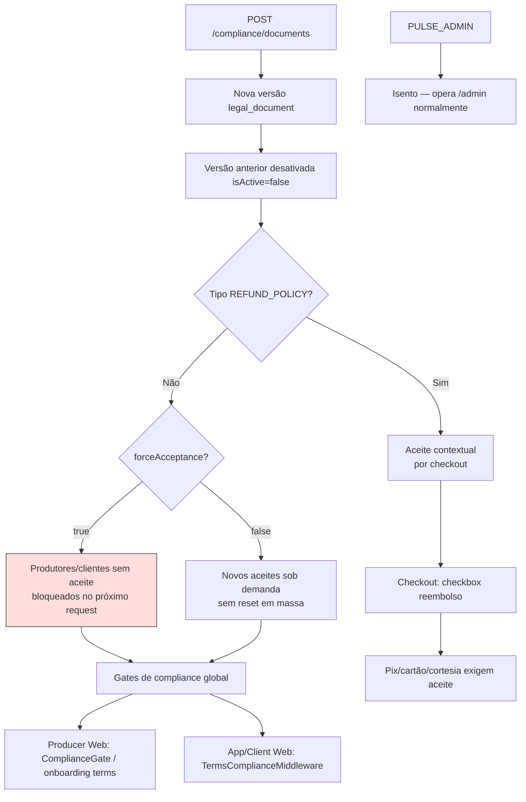

# Compliance documentos legais — Parte 3: publicação e efeitos

**Status:** [IMPLEMENTADO]

**Efeitos de negócio**

- `forceAcceptance` é a alavanca de **reaceite obrigatório** após mudança material em documentos globais.
- `REFUND_POLICY` não bloqueia login; ela é aceita por sessão antes de Pix, cartão ou cortesia.
- Cards na UI mostram `adoptionPercent` e `acceptedCount`; para `REFUND_POLICY`, o KPI usa aceites contextuais.
- Logs granulares ficam em `GET /api/admin/v1/compliance/acceptance-logs` e exportação em `/acceptance-logs/export`.

**Referências**

- `TermsComplianceMiddleware.ts` — bypass `/api/admin/v1`
- [checkout-compliance.md](../../../regras-negocio/checkout-compliance.md)
