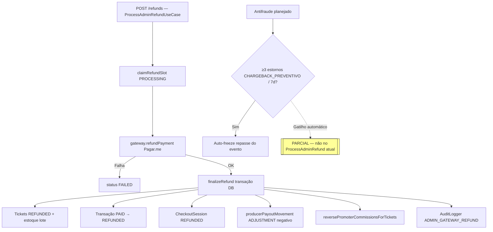

# Estornos — Parte 3: execução e efeitos

**Status execução:** [IMPLEMENTADO] · **Antifraude auto-freeze:** [PARCIAL]

**Efeitos de negócio**

- Estorno admin é **irreversível** no gateway; QR dos ingressos invalidados (`REFUNDED-{id}-...`).
- KPI chargeback na tela financeiro usa stats agregados (proxy 30d), não disputas do gateway.

**Referências**

- `ProcessAdminRefundUseCase.ts`, motivos em `adminRefund.ts`
- Congelamento manual: [financeiro-repasse](../financeiro-repasse/)
