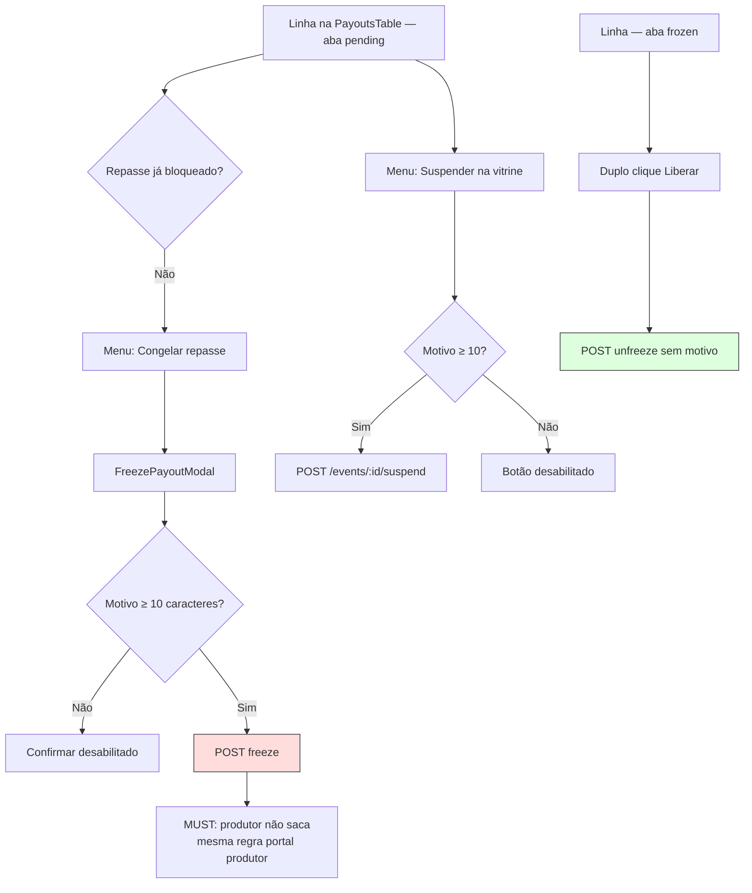

# Financeiro repasse — Parte 2: ações e validação

Freeze manual, unfreeze e moderação de evento (menu de ações).

**Observações**

- Unfreeze na aba `frozen` usa confirmação dupla (4s), sem modal de motivo.
- `PayoutActionsMenu` também oferece suspensão global do evento na vitrine (moderação — [IMPLEMENTADO]).
