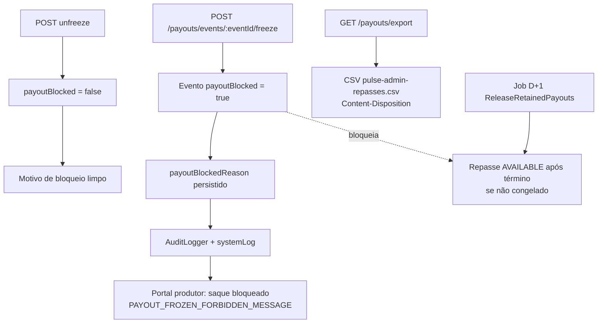

# Financeiro repasse — Parte 3: persistência e efeitos

**Status:** [IMPLEMENTADO] · `FreezeEventPayoutUseCase`, `UnfreezeEventPayoutUseCase`.

**Integrações**

- Bloqueio de estorno em evento congelado: validação em `ValidateAdminRefundUseCase` (ver [estornos](../estornos/)).
- Antifraude auto-freeze por chargeback: [PARCIAL] — documentado em pulse-admin; threshold no código ainda sem gatilho automático pós-estorno.

**Referências**

- `freeze-payout-modal.tsx`, `admin.service.exportFinanceExtract`
