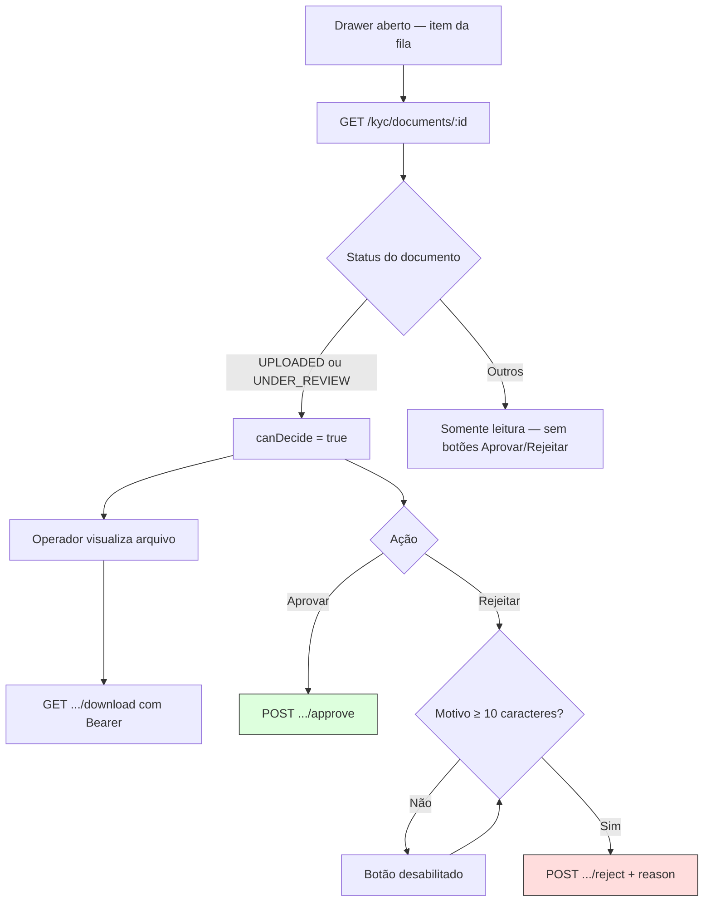

# KYC titular — Parte 2: revisão e validação

Condições na UI (`kyc-review-view.tsx`) e no backend antes de aprovar/rejeitar.

**Regras backend (`ApproveAdminKycDocumentUseCase` / reject)**

- Documento deve existir e estar em `PRODUCER_KYC_QUEUE_STATUSES`; caso contrário **409** `INVALID_STATUS`.
- Rejeição persiste `rejectionReason` visível ao produtor.
