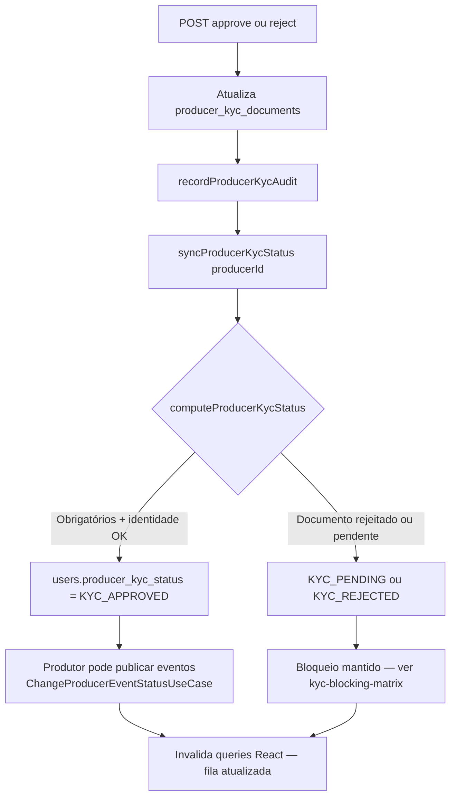

# KYC titular — Parte 3: persistência e efeitos

Após decisão, o titular recebe status agregado; publicação de evento depende de `KYC_APPROVED`.

**Efeito de negócio**

- `KYC_APPROVED` é o gate para **publicar** evento (não para criar rascunho em todas as superfícies — ver matriz).
- App Produtor envia documentos; admin apenas **decide** na fila (espelho operacional).

**Referências**

- `syncProducerKycStatus`, `producerKycHelpers.ts`
- Produtor: onboarding KYC em [app-produtor.md](../../../app-produtor.md)
