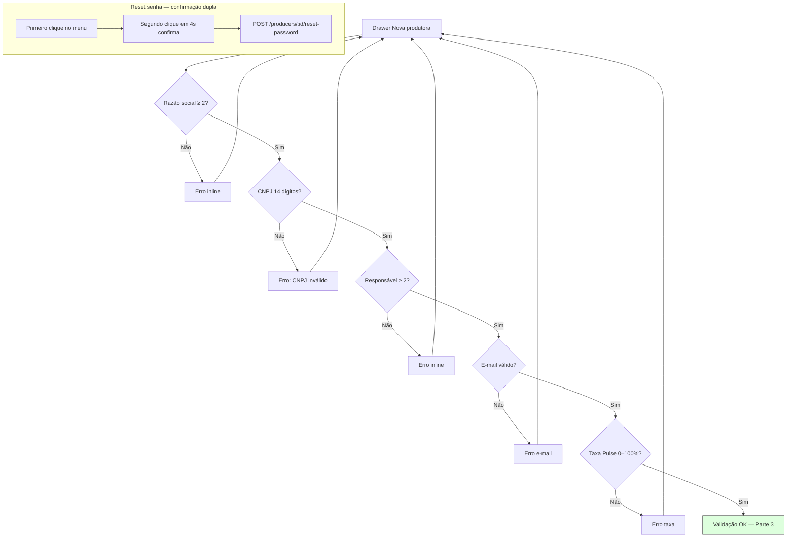

# Produtoras — Parte 2: formulário e validação

Schema Zod em `create-producer-drawer.tsx` antes de `POST /producers`.

**Observações**

- `pulseFeePercent` na UI converte para `pulseFeeBps` (ex.: 10% → 1000 bps) no `adminService.createProducer`.
- Reset de senha não abre modal de motivo — confirmação por duplo clique na tabela.
