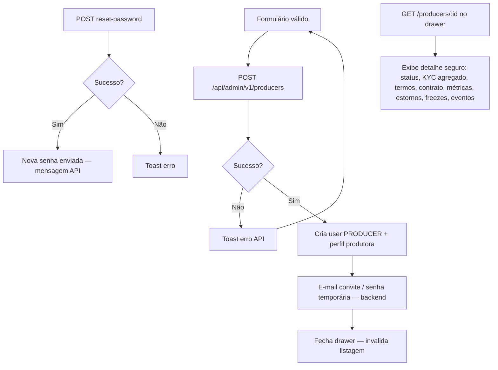

# Produtoras — Parte 3: persistência e efeitos

**Status:** [IMPLEMENTADO]

**Efeitos colaterais**

- Nova produtora inicia com KYC `NOT_STARTED` ou `KYC_PENDING` conforme documentos — publicação bloqueada até aprovação admin ([kyc-aprovacao](../kyc-aprovacao/)).
- Operador não usa portal produtor (`/dashboard`); middleware redireciona `PULSE_ADMIN` para `/admin/visao`.

## Detalhe seguro da produtora (HU02b — Fase 0)

`GET /api/admin/v1/producers/:id` retorna uma visão consolidada para suporte operacional:

| Bloco | Conteúdo |
| --- | --- |
| `producer` | Dados básicos, CNPJ, taxa Pulse, contato e `mustChangePassword` |
| `operationalStatus` | Status derivado para UI; `PENDING` = primeira senha pendente |
| `kyc` | Status agregado separado do status operacional: `NOT_STARTED`, `KYC_PENDING`, `KYC_APPROVED`, `KYC_REJECTED` |
| `terms` | Último aceite de termos da plataforma |
| `commercialContract` | Resumo do contrato comercial vigente, quando existir |
| `metrics` | Indicadores operacionais e financeiros resumidos |
| `refunds` | Resumo de estornos/chargebacks |
| `payoutFreezes` | Congelamentos recentes de repasse |
| `recentEvents` | Eventos recentes da produtora |

**Segurança:** o DTO do detalhe não inclui arquivos KYC, URLs de download, `storageKey`, nomes de arquivo nem metadados sensíveis de documentos. Visualização/download documental permanece exclusivamente no fluxo [KYC — aprovação documental](../kyc-aprovacao/), com autorização admin e auditoria próprias.

**Próximas fases:** estados `SUSPENDED` e `BLOCKED` já estão preparados na UI, mas ainda dependem de ação persistida no backend. Sem issue canônica vinculada neste repositório: Fase 1 deve cobrir suspender/bloquear com motivo e audit log; Fase 2 deve criar atalhos auditáveis para documentos/contratos sem expandir o DTO seguro; Fase 3 deve consolidar timeline operacional e alertas.

**Referências**

- `CreateProducerDrawer`, `ProducerDetailDrawer`, `useCreateProducer`, `useResetProducerPassword`
