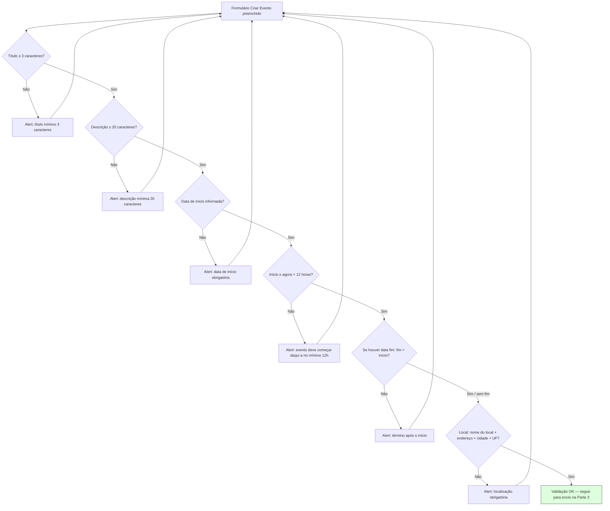

# Criação de evento — Parte 2: formulário e validação

Condições implementadas em `handleCreateDraft` em `events/create.tsx` (antes de chamar a API).

**Observações do código**

- Categoria, banner padrão (`DEFAULT_EVENT_BANNER_URL`), `visibility: PUBLIC` e `facialRequired: true` são definidos no submit, não no diagrama de validação do usuário.

