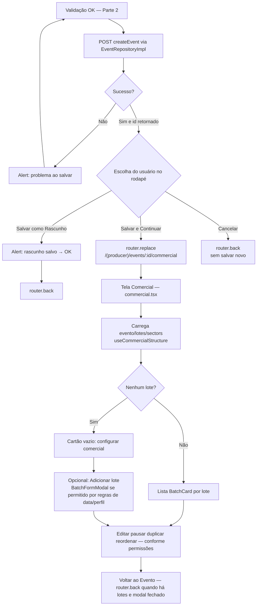

# Criação de evento — Parte 3: persistência, rascunho e comercial

Após validações (parte 2), `createEvent` grava o rascunho. Botões ao final da tela em `create.tsx`.

**Referências**

- `handleCreateDraft(continueToCommercial)` em `app/(producer)/(tabs)/events/create.tsx`: `true` → comercial; `false` → alerta + `router.back()`.
- Comercial: `app/(producer)/(tabs)/events/[id]/commercial.tsx`, `BatchFormModal`.

