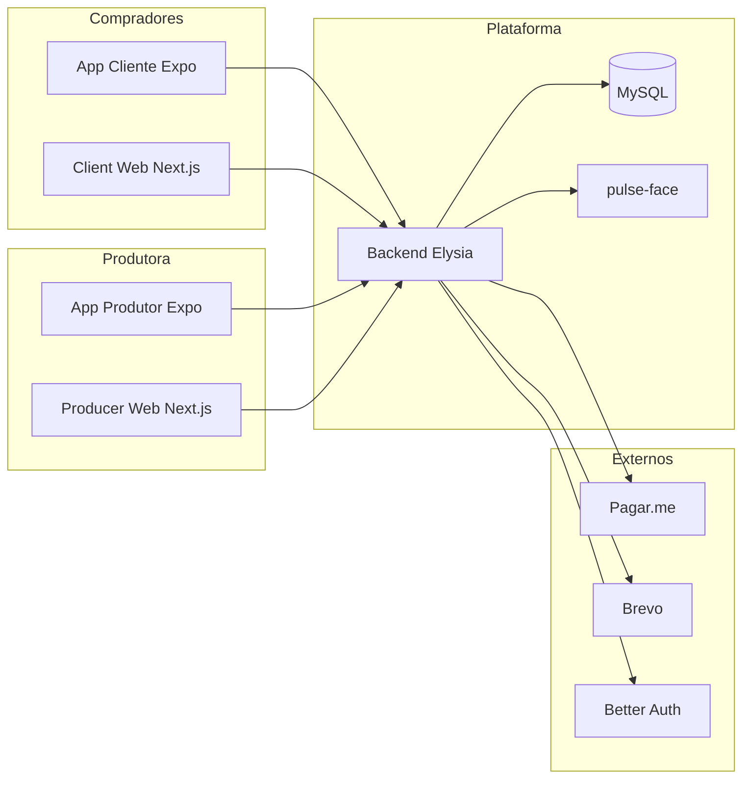

# Arquitetura do ecossistema Pulse

> Escopo: visão técnica de alto nível | Público: engenharia e PO | Plataforma: monorepo | Última revisão: 2026-05-19

## Legenda de status

| Tag | Significado |
| --- | --- |
| `[IMPLEMENTADO]` | Entregue e utilizável em produção ou demo estável |
| `[PARCIAL]` | Fluxo existe com lacunas (inclui UI «em breve») |
| `[PENDENTE]` | Não implementado ou apenas planejado |

Fonte de status: código (`app-producer`, `producer-web`, `app-client`, `client-web`, `backend`) + `docs/RBAC.md` + revisão 2026-05-19.

## 1. Visão geral

Ecossistema **monorepo**: backend único (Elysia/Node + Prisma/MySQL), quatro frontends e serviço auxiliar de biometria.

## 2. Superfícies de API

| Prefixo | Consumidores | Descrição |
| --- | --- | --- |
| `/api/client/v1/*` | App Cliente, Client Web (futuro) | B2C canônico (OpenAPI) |
| Raiz legada (`/auth`, `/events`, …) | Apps antigos | Espelho; evitar em clientes novos |
| `/api/producer/v1/*` | App Produtor, Producer Web produtora | Portal + operação |
| `/api/admin/v1/*` | Pulse Admin | Restrito a `PULSE_ADMIN` |
| `/api/promoter/*` | App Cliente (promoter) | Comissões e vendas |
| `/api/auth/*` | Todos | Better Auth handler |
| `/internal/facial-*` | Jobs/cron | API key; galeria e retenção |

## 3. Autenticação e sessão

- **B2C:** Better Auth via `/api/client/v1/auth/*` (cadastro/login comprador).
- **Produtor:** `/api/producer/v1/auth/login` + onboarding; compliance gate em rotas protegidas.
- **Admin:** login em 2 etapas (senha → OTP e-mail) em `/api/admin/v1/auth/*`.

## 4. Módulos backend (domínio)

| Módulo | Responsabilidade |
| --- | --- |
| Events / Commercial | CRUD eventos, setores, lotes, readiness |
| Checkout / Payment | Reserva, Pix/cartão, tentativas |
| Tickets | Carteira, transferência, cancelamento |
| Operation | Check-in QR, facial, lista |
| Finance / Payouts | Ledger, repasse, freeze |
| Compliance | Termos versionados, `forceAcceptance` |
| KYC | Documentos produtor (titular) |
| Biometry | Enrollment e embeddings |

## 5. Integrações e dependências

| Sistema | Uso |
| --- | --- |
| MySQL | Persistência Prisma |
| Pagar.me | Captura e estornos |
| Brevo | E-mail transacional (OTP admin, convites) |
| pulse-face | Extração/validação facial |
| EAS / Vercel | Deploy apps e web |

## 6. Variáveis de ambiente (resumo)

Ver tabela completa em [api-endpoints.md](./api-endpoints.md#recursos) e `backend/README.md`.

| Categoria | Exemplos |
| --- | --- |
| Banco | `DATABASE_URL` |
| Auth | `BETTER_AUTH_SECRET`, `BETTER_AUTH_URL` |
| Pagamentos | `PAGARME_SECRET_KEY`, `PAYMENTS_ENABLED` (apps) |
| Facial | `PULSE_FACE_SERVICE_URL`, flags `FACIAL_*` |
| Admin | seed `PULSE_ADMIN` (`bun run seed:pulse-admin`) |

## 7. Referências cruzadas

- [README.md](./README.md) — índice funcional
- [api-endpoints.md](./api-endpoints.md) — catálogo HTTP
- [../product/technical/ARCHITECTURE_PRINCIPLES.md](../product/technical/ARCHITECTURE_PRINCIPLES.md)
