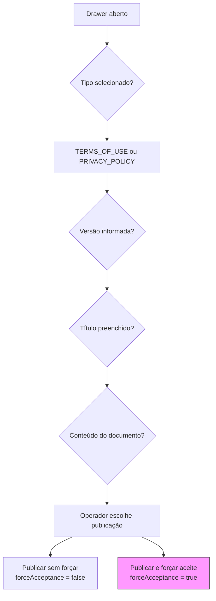

# Compliance termos — Parte 2: formulário e validação

Drawer «Nova versão de termo» antes de publicar.

**Observações**

- Default no `adminService.publishLegalDocument`: `forceAcceptance ?? true` se omitido na API; a UI oferece os dois botões explicitamente (`handlePublish(force)`).
- Versão sugerida no card (ex.: incremento manual `2.4`).
