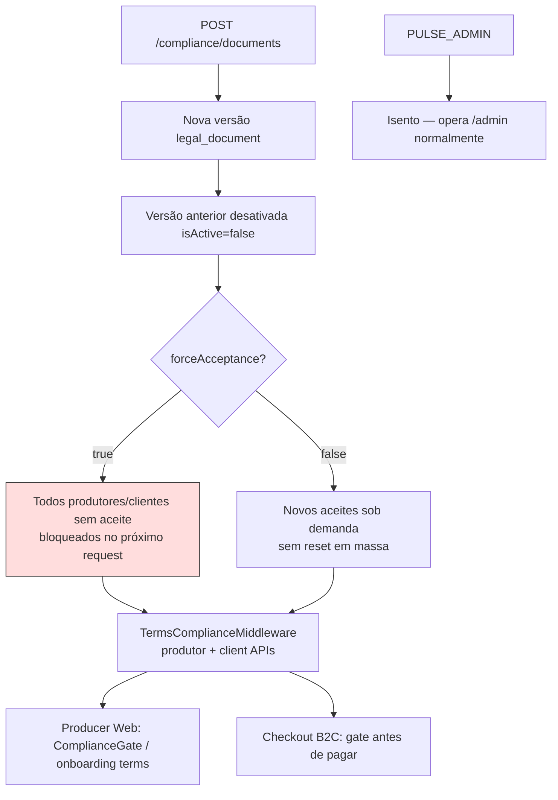

# Compliance termos — Parte 3: publicação e efeitos

**Status:** [IMPLEMENTADO]

**Efeitos de negócio**

- `forceAcceptance` é a alavanca de **reconsentimento obrigatório** após mudança material (LGPD / termos).
- Cards na UI mostram `adoptionPercent` e `acceptedCount` pós-publicação.

**Referências**

- `TermsComplianceMiddleware.ts` — bypass `/api/admin/v1`
- [CHECKOUT_COMPLIANCE.md](../../../policies/checkout-compliance.md) (alias checkout-compliance)
