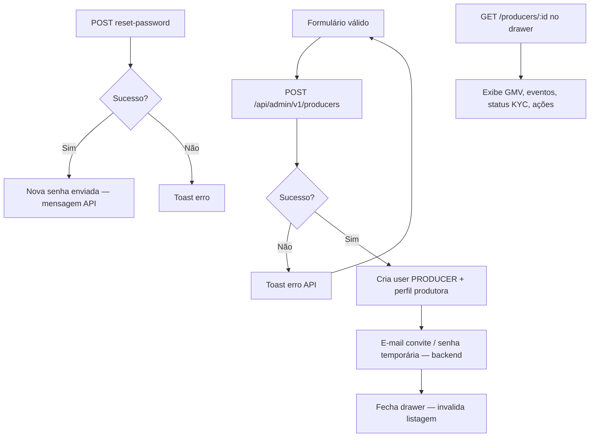

# Produtoras — Parte 3: persistência e efeitos

**Status:** [IMPLEMENTADO]

**Efeitos colaterais**

- Nova produtora inicia com KYC `NOT_STARTED` ou `KYC_PENDING` conforme documentos — publicação bloqueada até aprovação admin ([kyc-aprovacao](../kyc-aprovacao/)).
- Operador não usa portal produtor (`/dashboard`); middleware redireciona `PULSE_ADMIN` para `/admin/visao`.

**Referências**

- `CreateProducerDrawer`, `ProducerDetailDrawer`, `useCreateProducer`, `useResetProducerPassword`
